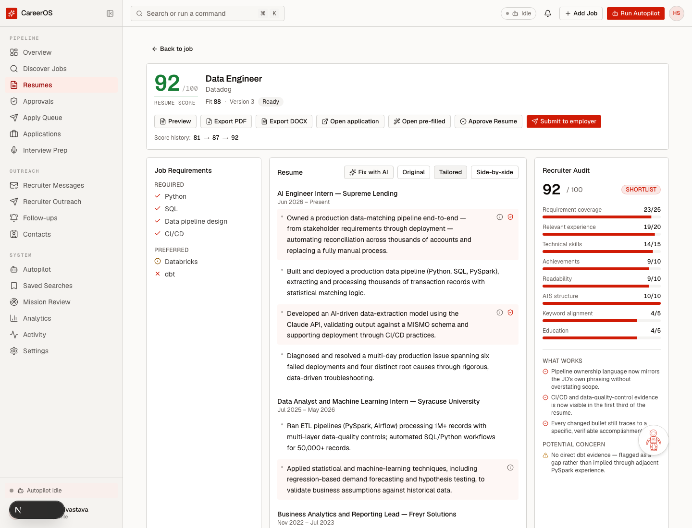
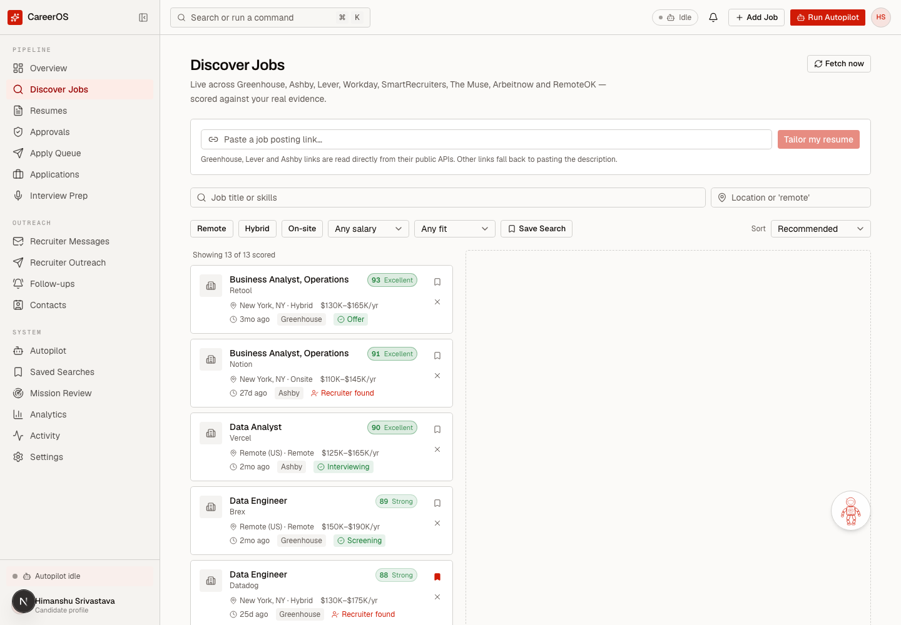
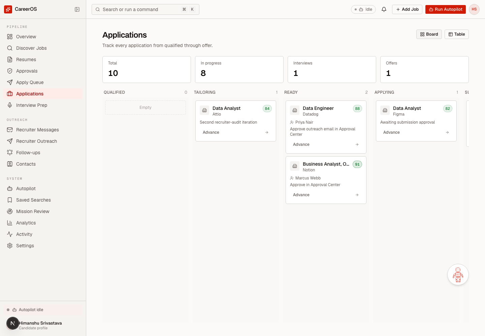

# careeros-web

> **Part of CareerOS** — [careeros-api](https://github.com/Himansh97/careeros-api) (backend) · **careeros-web** (frontend)

Frontend for CareerOS. Next.js 16, React 19, TypeScript, Tailwind v4, shadcn/ui.
35 routes over one pipeline: discovery, fit breakdowns, in-app resume editing,
approvals, recruiter messages, outreach and interview practice.



The screenshot above is the whole argument in one view. Requirements are ticked
only where evidence exists, every changed bullet carries a marker back to the
claim it came from, and the audit panel's concern reads *"No direct dbt evidence
— flagged as a gap rather than implied through adjacent PySpark experience."*
Implying it would have been the easy score.

<details>
<summary>Two more views</summary>





</details>

> Screenshots are rendered from the mock data layer (`NEXT_PUBLIC_USE_MOCK_DATA=true`),
> not from a live database. The companies shown are invented.

## Three rules this is built around

**Nothing auto-submits.** Buttons prepare and stage; the person applies. The copy
is held to this too — "Open application" and "Mark as applied", never "Approve &
Submit". The backend is structurally incapable of pressing submit, and the UI must
never imply otherwise.

**Never show mock data as if it were real.** `isLiveApi()` and `isMockData()` in
`src/lib/api/client.ts` gate every query. A backend that is down surfaces as an
explicit not-connected state, never as plausible-looking zeros — because a
pipeline that reads "0 applications" when the API is unreachable is worse than one
that reads "cannot reach the API".

**Report honestly what the backend actually did.** If search scored a subset of
matches, the page says "N of M scored" rather than presenting a partial ranking as
a complete one.

## Notable

- **`apiFetch` never throws.** It returns a discriminated union — `{ok: true, data}`
  or `{ok: false, reason}` — because a disconnected backend is a normal state in a
  local-first tool, not an exception.
- **The React Compiler is on**, which makes `setState` inside an effect a lint
  error. Continuous animation is driven by framer-motion `MotionValue`s off the
  React render path, and values that live outside React are read through
  `useSyncExternalStore`.
- **Reduced motion is a hard requirement.** `globals.css` neutralises CSS
  transitions globally, so anything that animates has to degrade to a static state
  rather than a slower one.
- The palette is the 1975 NASA Graphics Standards Manual; interview readiness is
  presented as a launch poll, reading GO / HOLD / NO-GO per competency.

## Running it

```bash
npm install
npm run dev        # :3311
```

`.env.local` holds `NEXT_PUBLIC_API_URL=http://localhost:8000`. Start
[careeros-api](https://github.com/Himansh97/careeros-api) first, or every page
shows its not-connected state — which is the honest thing for it to do.

```bash
npm run lint       # must be clean
npx tsc --noEmit   # must be clean
```

Both clean is the bar before anything is called done, and then the flow gets
clicked — several bugs here type-checked and linted perfectly while being
completely broken at runtime.

## Technical Interview Lab

`/prep/technical` is a guided mission map for analytics-core, data-stack, and
role-specific preparation. Every drill follows Brief → Example → Practice →
Review → Transfer, with progressive hints and explicit solution reveal. The SQL
editor uses CodeMirror, Python/Pandas runs in a dedicated Pyodide Web Worker, and
written cases expose structured interview rubrics.

`/prep/technical/interview` starts frozen 30/45/60-minute mixed rounds. Answers
autosave, the countdown is anchored to server time, and correctness remains
locked until the round is submitted or expires. Results show deterministic
per-skill feedback and a review queue—no leaderboard, arbitrary points, or streak
penalty.

```bash
npm test
npm run lint
npx tsc --noEmit
npm run build
```

When the API is unavailable, the lab reports a disconnected state and never
substitutes generated mastery or attempt data.

## Data

The candidate's own data lives in a separate private repository. Nothing personal
is committed here.
